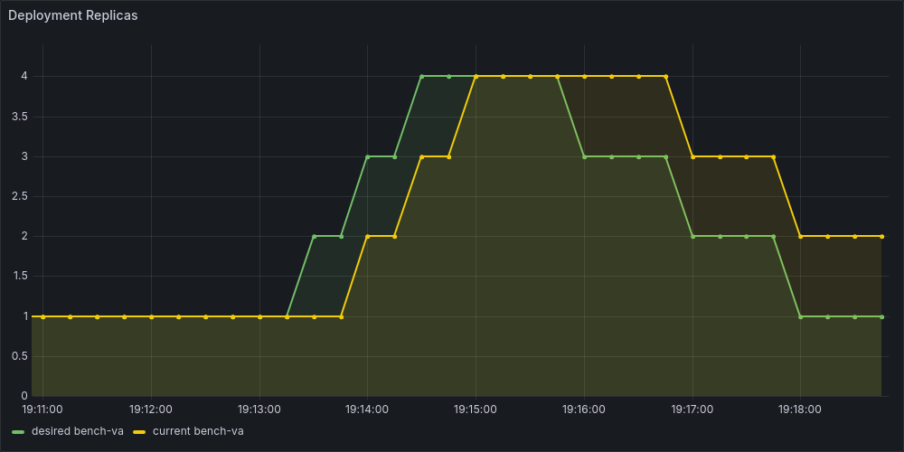
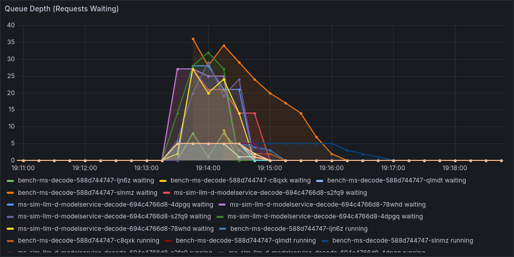
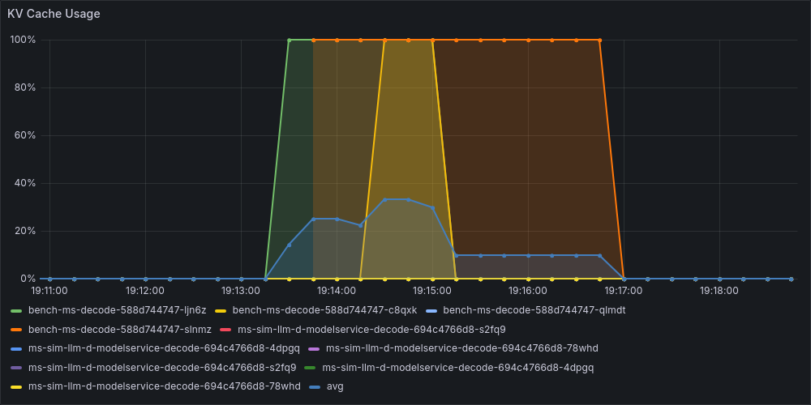
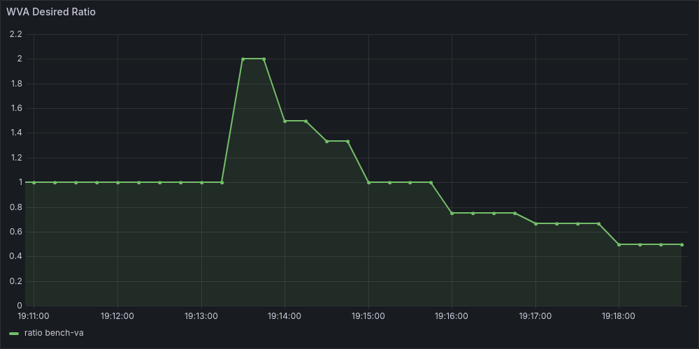
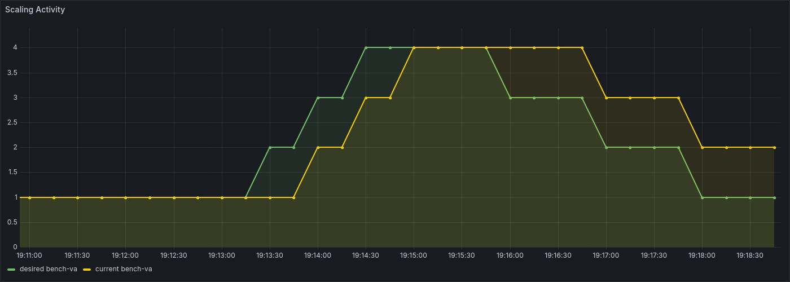

### Benchmark: scale-up-latency (Kind)

| Metric | Value |
|--------|-------|
| Scale-up time | 54.2s |
| Scale-down time | 120.1s |
| Max replicas | 4 |
| Avg KV cache usage | 0.167 |
| Avg queue depth | 7.0 |
| Replica oscillation (σ) | 0.62 |
| Total duration | 475s |

Dashboard Panels (5)

