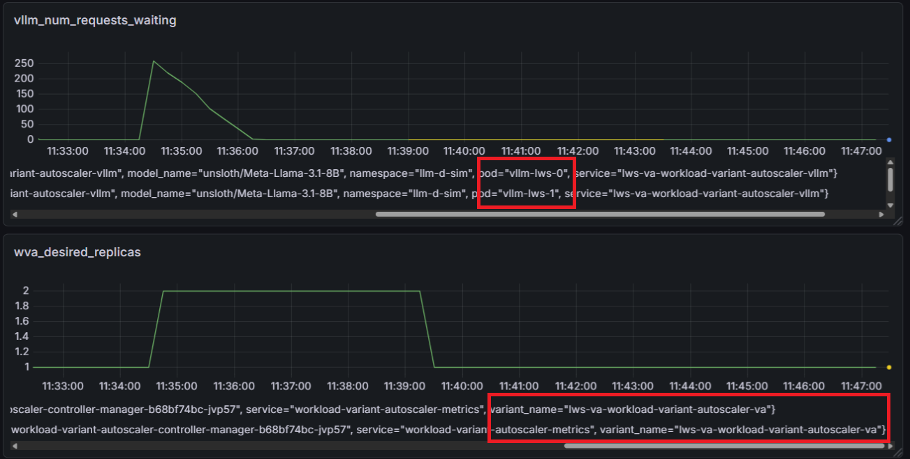

# Support LeaderWorkerSet (LWS) as WVA Scale Target

## Overview
In addition to supporting Deployment as scale target for WVA variant, WVA also supports LWS as scale target.

## Prerequisites
First, you need to [install LWS](https://lws.sigs.k8s.io/docs/installation/) in order to create a LWS resource in your Kubernetes cluster. Here is a sample command to install and verify LWS:
```
# Sample command to install LWS
 CHART_VERSION=0.8.0
 helm install lws oci://registry.k8s.io/lws/charts/lws \
  --version=$CHART_VERSION \
  --namespace lws-system \
  --create-namespace \
  --wait --timeout 300s
```
To verify LWS has been installed in the cluster:
```
kubectl get crd leaderworkersets.leaderworkerset.x-k8s.io
NAME                                        CREATED AT
leaderworkersets.leaderworkerset.x-k8s.io   2026-03-18T19:36:48Z
```
## Prepare Existing WVA controller
If there's an existing WVA controller, you will need to run the installation again since there are additional cluster roles needed to be created to support LWS.

## Check WVA controller for LWS support
There's no additional configuration needed in WVA controller to enable LWS support - it enabled by default. If the cluster has LWS installed, WVA controller log file should contain:
```
2026-03-21T09:02:09-04:00	INFO	setup	cmd/main.go:202	LeaderWorkerSet CRD detected - support enabled
```
Otherwise, the log should contain:
```
2026-03-21T09:13:31-04:00	INFO	setup	cmd/main.go:204	LeaderWorkerSet CRD not found - support disabled (Deployment-only mode)

```
## Create a LWS in the cluster
The rest of this document refers to the following sample LWS. We high-light some important fields and show how to verify LWS:
```
apiVersion: leaderworkerset.x-k8s.io/v1
kind: LeaderWorkerSet
metadata:
  ...
  name: vllm-lws
  namespace: llm-d-sim
spec:
  leaderWorkerTemplate:
    leaderTemplate:
      metadata:
        labels:
          llm-d.ai/inferenceServing: "true"
          llm-d.ai/model: ms-sim-llm-d-modelservice-lws
          llm-d.ai/role: decode
      spec:
        containers:
        - args:
          - --model
          - unsloth/Meta-Llama-3.1-8B
          - --port
          - "8200"
          - --served-model-name
          - unsloth/Meta-Llama-3.1-8B
          - --time-to-first-token=200
          - --inter-token-latency=20
          env:
          ...
    size: 2  <== 1 leader + 1 worker
    workerTemplate:
      metadata: {}
      spec:
        containers:
        - args:
          - --model
          - unsloth/Meta-Llama-3.1-8B
          - --port
          - "8200"
          - --served-model-name
          - unsloth/Meta-Llama-3.1-8B
          - --time-to-first-token=200
          - --inter-token-latency=20
         ...
  networkConfig:
    subdomainPolicy: Shared
  replicas: 1  <== 1 replica
  ...
```
List LWS:
```
kubectl get lws -n llm-d-sim
NAME       READY   DESIRED   UP-TO-DATE   AGE
vllm-lws   1       1         1            12m
```
List services:
```
kubectl get svc -n llm-d-sim
NAME                                TYPE        CLUSTER-IP      EXTERNAL-IP   PORT(S)             AGE
vllm-leader                         ClusterIP   10.96.91.77     <none>        8200/TCP            45h
vllm-lws                            ClusterIP   None            <none>        <none>              18m
```
List statefulSets:
```
kubectl get statefulsets -n llm-d-sim
NAME         READY   AGE
vllm-lws     1/1     15m
vllm-lws-0   1/1     15m
```
List pods:
```
kubectl get po -n llm-d-sim
NAME                                                 READY   STATUS    RESTARTS   AGE
vllm-lws-0                                           2/2     Running   0          10m
vllm-lws-0-1                                         2/2     Running   0          10m
```
When number of replica is 2, list pods:
```
vllm-lws-0                                           2/2     Running     0          73m
vllm-lws-0-1                                         2/2     Running     0          73m
vllm-lws-1                                           0/2     Completed   0          5s
vllm-lws-1-1                                         1/2     Running     0          5s
```
Send `chat` to service:
```bash
kubectl exec vllm-lws-0 -n llm-d-sim -- curl -k http://vllm-lws:8200/v1/chat/completions -H Content-Type: application/json --data {"model": "unsloth/Meta-Llama-3.1-8B", "max_tokens": 256, "messages": [{ "role": "user", "content":  "hi" }]}

{"id":"chatcmpl-a9ea5966-5445-5449-a95a-b9ffcd63f234","created":1774103821,"model":"unsloth/Meta-Llama-3.1-8B","usage":{"prompt_tokens":1,"completion_tokens":239,"total_tokens":240},"object":"chat.completion","kv_transfer_params":null,"choices":[{"index":0,"finish_reason":"stop","message":{"role":"assistant","content":"The rest is silence.  Give a man a fish and you feed him for a day; t..."}}]}

```

## Create WVA variant with LWS as scale target
As documented in `./workload-variant-autoscaler/values.yaml`, the parameters `scaleTargetKind`, `scaleTargetName` are new to distinguish LWS from Deployment as scale target:

```
llmd:
  ...

  # scaleTargetKind: Optional. If not specified or empty, it will be set to "Deployment". 
  # Valid values are "Deployment", "LeaderWorkerSet" - case sensitive.
  #scaleTargetKind: "Deployment"
  
  # scaleTargetName: Name of the scale target resource.
  # For "Deployment": name of the Deployment.
  # For "LeaderWorkerSet": name of the LeaderWorkerSet.
  #scaleTargetName: 
```

Below is a sample command to a create a variant with LWS as scale target:
```bash
  helm install lws-va ./workload-variant-autoscaler \
    -n workload-variant-autoscaler-system \
    --set controller.enabled=false \
    --set va.enabled=true \
    --set hpa.enabled=true \
    --set llmd.namespace=llm-d-sim \
    --set llmd.modelName=ms-sim-llm-d-modelservice-lws \
    --set llmd.modelID="unsloth/Meta-Llama-3.1-8B" \
    --set llmd.scaleTargetName="vllm-lws" \
    --set llmd.scaleTargetKind="LeaderWorkerSet" \
    --values ./workload-variant-autoscaler/values.yaml
```
Verify the sample variant. Here we include and high-light the important fields:
```
kubectl get va lws-va-workload-variant-autoscaler-va -n llm-d-sim -o yaml

apiVersion: llmd.ai/v1alpha1
kind: VariantAutoscaling
metadata:
  ...
  name: lws-va-workload-variant-autoscaler-va
  namespace: llm-d-sim
spec:
  maxReplicas: 2
  minReplicas: 1
  modelID: unsloth/Meta-Llama-3.1-8B
  scaleTargetRef:
    apiVersion: leaderworkerset.x-k8s.io/v1   <===
    kind: LeaderWorkerSet   <===
    name: vllm-lws   <===
  variantCost: "10.0"
status:
  conditions:
  - lastTransitionTime: "2026-03-21T14:54:56Z"
    message: Scale target LeaderWorkerSet vllm-lws found   <===
    observedGeneration: 1
    reason: TargetFound
    status: "True"
    type: TargetResolved
  - lastTransitionTime: "2026-03-21T14:54:56Z"
    message: Saturation metrics data is available for scaling decisions
    observedGeneration: 1
    reason: MetricsFound
    status: "True"
    type: MetricsAvailable
  desiredOptimizedAlloc:
    accelerator: H100
    lastRunTime: "2026-03-21T14:55:27Z"
    numReplicas: 1

```
Verify the scaler created with the sample variant:
```
kubectl get hpa lws-va-workload-variant-autoscaler-hpa -n llm-d-sim -o yaml

apiVersion: autoscaling/v2
kind: HorizontalPodAutoscaler
metadata:
  ...
  name: lws-va-workload-variant-autoscaler-hpa
  namespace: llm-d-sim
spec:
  behavior:
    ...
  maxReplicas: 2
  metrics:
  - external:
      metric:
        name: wva_desired_replicas
        selector:
          matchLabels:
            exported_namespace: llm-d-sim
            variant_name: lws-va-workload-variant-autoscaler-va   <===
      target:
        averageValue: "1"
        type: AverageValue
    type: External
  minReplicas: 1
  scaleTargetRef:
    apiVersion: leaderworkerset.x-k8s.io/v1   <===
    kind: LeaderWorkerSet   <===
    name: vllm-lws   <===
status:
  conditions:
  - lastTransitionTime: "2026-03-21T14:50:33Z"
    message: recommended size matches current size
    reason: ReadyForNewScale
    status: "True"
    type: AbleToScale
  - lastTransitionTime: "2026-03-21T14:55:11Z"
    message: 'the HPA was able to successfully calculate a replica count from external
      metric wva_desired_replicas(&LabelSelector{MatchLabels:map[string]string{exported_namespace:
      llm-d-sim,variant_name: lws-va-workload-variant-autoscaler-va,},MatchExpressions:[]LabelSelectorRequirement{},})'
    reason: ValidMetricFound
    status: "True"
    type: ScalingActive
  - lastTransitionTime: "2026-03-21T14:55:11Z"
    message: the desired count is within the acceptable range
    reason: DesiredWithinRange
    status: "False"
    type: ScalingLimited
  currentMetrics:
  - external:
      current:
        averageValue: "1"
      metric:
        name: wva_desired_replicas
        selector:
          matchLabels:
            exported_namespace: llm-d-sim
            variant_name: lws-va-workload-variant-autoscaler-va
    type: External
  currentReplicas: 1
  desiredReplicas: 1
```
## Scaling Test
Here is an example scaling LWS when sending many of the above `chat` to the LWS service.

